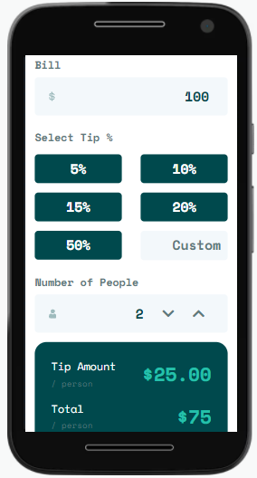

# Frontend Mentor - Tip Calculator App Solution

Essa é uma solução para o desafio da [calculadora de gorjeta do Frontend Mentor](https://www.frontendmentor.io/challenges/tip-calculator-app-ugJNGbJUX).

### Visão Geral

#### O desafio

O usuário pode:

- Ver o layout do aplicativo independente do tamanho da tela (Design Responsivo);
- Ver os estados ativos e com foco dos elementos;
- Calcular o valor correto da gorjeta e o custo total da conta por pessoa;

#### Screenshot

#### Links

- Live Site URL: [Github Pages](https://oliverids.github.io/Tip-calculator/)

## Processo

#### Feito com

- HTML5 semântico
- Propriedades CSS customizadas
- Flexbox
- SASS Compiler
- Mobile-first Workflow
- JavaScript

 
##### Frontend Mentor - [@oliverids](https://www.frontendmentor.io/profile/oliverids)
